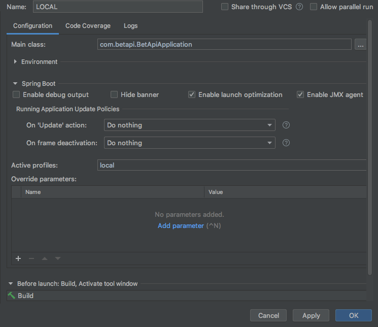
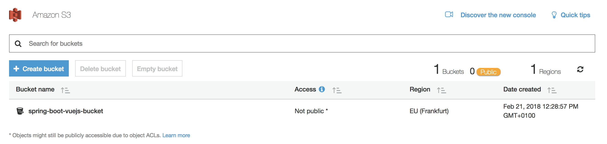
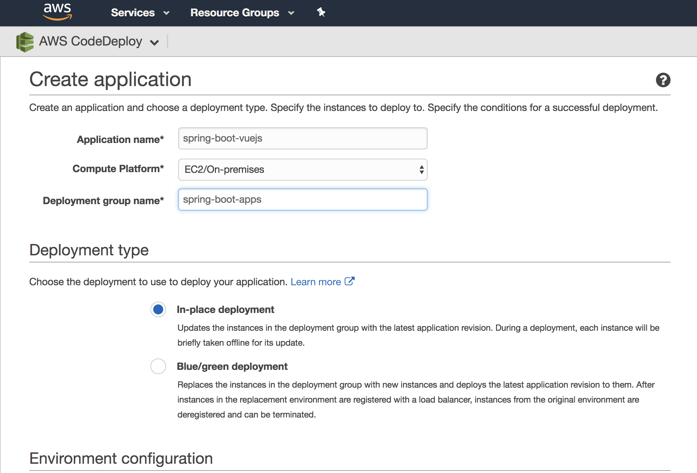
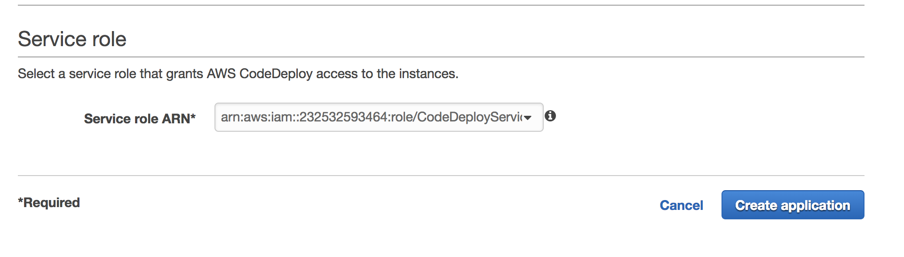
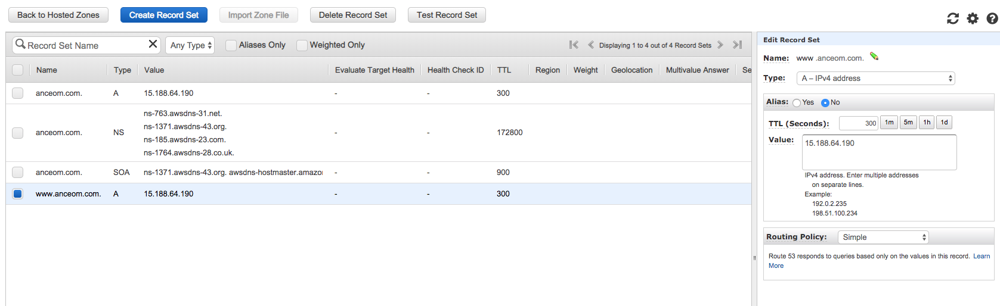

# bets-api

Bets-api is a system made to help clients register their bets on Sport games 
- Swagger PROD EC2 : (http://ec2-34-218-226-215.us-west-2.compute.amazonaws.com:8080/swagger-ui.html
- Logs PROD EC2 : (http://ec2-34-218-226-215.us-west-2.compute.amazonaws.com:8080/actuator/logfile)

## How to run locally
On Intelli J use the spring profile `local`  or add the option `-Dspring.profiles.active=local` to the command line



This profile will use an inmemory database and ou will be able to use the swagger and the secured endpoints with the credentials : 
<br>
`Username : root
 | Password : root
` 

## Database 
The PROD database is hosted on RDS with Postgres SQL. 
If you're having troubles connecting to the database you may check the security rules and groups setup. The local database runs on H2 (In memory database)

## Logs
In order to see realtime logs you need to connect to the EC2-instance using ssh with a .pem key
<br>
`ssh -i "key.pem" ec2-user@ec2-34-218-226-215.us-west-2.compute.amazonaws.com`
<br>
Once logged on the machine the logs are located in bets-api/logs. Use the command 
<br>
`tail -f -n 1000 bets-api/logs/bets-api.log`
<br>
You can view the logs using the actuator endpoint : 
<br>
https://anceom.com:8081/bets-api/actuator/logfile


## Setuping Continous Delivery using AWS `Codedeploy`and `Codepipeline`

#### Prerequisites
###### Check the AWS documentation for codedeploy
https://docs.aws.amazon.com/codedeploy/latest/userguide/welcome.html

https://docs.aws.amazon.com/codedeploy/latest/userguide/getting-started-codedeploy.html

###### Create awscodedeploy Policy

First create a new Policy `awscodedeploy` at https://console.aws.amazon.com/iam/home#/policies with the following JSON (for more info, see https://docs.aws.amazon.com/codedeploy/latest/userguide/getting-started-provision-user.html):

```
{
  "Version": "2012-10-17",
  "Statement" : [
    {
      "Effect" : "Allow",
      "Action" : [
        "autoscaling:*",
        "cloudformation:*",
        "codedeploy:*",
        "ec2:*",
        "lambda:*",
        "elasticloadbalancing:*",
        "iam:AddRoleToInstanceProfile",
        "iam:CreateInstanceProfile",
        "iam:CreateRole",
        "iam:DeleteInstanceProfile",
        "iam:DeleteRole",
        "iam:DeleteRolePolicy",
        "iam:GetInstanceProfile",
        "iam:GetRole",
        "iam:GetRolePolicy",
        "iam:ListInstanceProfilesForRole",
        "iam:ListRolePolicies",
        "iam:ListRoles",
        "iam:PassRole",
        "iam:PutRolePolicy",
        "iam:RemoveRoleFromInstanceProfile", 
        "s3:*"
      ],
      "Resource" : "*"
    }    
  ]
}
```

###### Create a IAM User (don´t use your AWS root account)

Go to https://console.aws.amazon.com/iam/ and add a new User - here `aws-codedeploy-springboot` with programmatic access enabled. Go next and add the new User to the group `codedeploy` with the formerly created policy type `awscodedeploy`.

###### Install & configure AWS CLI (optional)

(details https://docs.aws.amazon.com/codedeploy/latest/userguide/getting-started-configure-cli.html)

* `brew install awscli`

* open new console and then type `aws configure`

* get the access key ID and secret access key for an IAM user from the formerly created IAM user at the console https://console.aws.amazon.com/iam/

* choose a appropriate the CodeDeploy supported regions (https://docs.aws.amazon.com/general/latest/gr/rande.html#codedeploy_region) - I wanted to go with Frankfurt/EU, so I chose `eu-central-1`

* select the default output format with typing `json`


##### Create two CI Policies

__Deploy-To-S3__

Go to https://console.aws.amazon.com/iam/home#/policies and create another policy called `Deploy-To-S3` with the following config:

```
{
    "Version": "2012-10-17",
    "Statement": [
        {
            "Effect": "Allow",
            "Action": [
                "s3:PutObject"
            ],
            "Resource": [
                "*"
            ]
        }
    ]
}
```

__Code-Deploy-Policy__

This one is tricky. Insert your server region (like `eu-west-3` : Paris) and your Account-Id (from the IAM dashboard https://console.aws.amazon.com/iam/home#/home, the first numbers from https://0123456789010.signin.aws.amazon.com/console directly beneath `IAM users sign-in link:`).

Also edit the `NameOfTheCodeDeployApplicationNameHERE` to your app´s name, like `bets-api`.

```
{
    "Version": "2012-10-17",
    "Statement": [
        {
            "Effect": "Allow",
            "Action": [
                "codedeploy:RegisterApplicationRevision",
                "codedeploy:GetApplicationRevision"
            ],
            "Resource": [
                "arn:aws:codedeploy:ServerRegionHERE:AccIdHERE:application:NameOfTheCodeDeployApplicationNameHERE"
            ]
        },
        {
            "Effect": "Allow",
            "Action": [
                "codedeploy:CreateDeployment",
                "codedeploy:GetDeployment"
            ],
            "Resource": [
                "*"
            ]
        },
        {
            "Effect": "Allow",
            "Action": [
                "codedeploy:GetDeploymentConfig"
            ],
            "Resource": [
                "arn:aws:codedeploy:ServerRegionHERE:AccIdHERE:deploymentconfig:CodeDeployDefault.OneAtATime",
                "arn:aws:codedeploy:ServerRegionHERE:AccIdHERE:deploymentconfig:CodeDeployDefault.HalfAtATime",
                "arn:aws:codedeploy:ServerRegionHERE:AccIdHERE:deploymentconfig:CodeDeployDefault.AllAtOnce"
            ]
        }
    ]
}
```


##### Create Bets-api user and group, with both Policies attached

Go to https://console.aws.amazon.com/iam/ and add a new User - here `Bets-api` with programmatic access enabled. Go next and add the user to a new group `Bets-api` and select both Travis Policies  `Travis-Deploy-To-S3` and `Travis-Code-Deploy-Policy`.

Note the Access key ID and the Secret access key somewhere safe.


##### Create a Service Role for AWS CodeDeploy

(more info https://docs.aws.amazon.com/codedeploy/latest/userguide/getting-started-create-service-role.html)

Go to https://console.aws.amazon.com/iam/ again and create a new Role. Select `CodeDeploy` under `Select your use case` below `AWS service`. Then next:Permissions - and the `AWSCodeDeployRole` Policy should show up. Then next:Review and type a Role name, like `CodeDeployServiceRole`.

If you want to restrict the ServiceRole even more, see https://docs.aws.amazon.com/codedeploy/latest/userguide/getting-started-create-service-role.html


##### Create a Service Role for our EC2 instance

Go to https://console.aws.amazon.com/iam/ again and create a new Role. Select `EC2` under `Select your use case` below `AWS service`. 

Then next:Permissions - and select the formerly created `awscodedeploy` Policy. Then next:Review and type a Role name, like `CodeDeploy-EC2-deploy-instance`.


##### Create EC2 instance (Ubuntu 16.04 LTS)

On your Main AWS dashboard click the big blue button __Launch Instance__. Now select e.g. `Ubuntu Server 16.04 LTS (HVM), SSD Volume Type` as AMI. Then select the "Free tier eligible" __t2.micro__ and don´t click the blue "Review and Lauch", instead click on __Next:Configure Instance Details__.

Be sure to __NOW__ select the pre-created IAM Service Role `CodeDeploy-EC2-deploy-instance` (you can´t do this step later on an existing EC2 instance!). Now click __Next:Add Storage__ and leave everything and click __Next:Add Tags__. Add a Tag for CodeDeploy to reference, like `codedeploy` as key and `This tag is used by CodeDeploy for... deployment`. 

Next configure 2 Security Groups: SSH (just click add Rule) and a Custom TCP Rule with port 8088 for our app.

Now click __Review and Launch__. (Don´t forget to download the keypair for later access of the instance)


##### Create S3 Bucket

Click on "Services" on top of the AWS console and type `S3` and click on it. Click `Create Bucket` button and type a name like `bets-api`. Overgo `Set properties` and `Set permissions` and then click `Create Bucket`. Should look like this:



##### Configure Amazon CodeDeploy

Click on "Services" on top of the AWS console and type `CodeDeploy` and click on it. Click on "Get Started Now" and choose the `custom deployment`/Skip Walkthrough. Type in an application name like `spring-boot-vuejs` (remember the NameOfTheCodeDeployApplicationNameHERE from the Travis-Code-Deploy-Policy) and a Deployment group name, like `spring-boot-apps`.



Select our EC2 instances with the configured Tag:


Now select the Service Role `CodeDeployServiceRole` we created:

 

And finally click on `Create Application`.

##### Connect to your EC2 instance
see https://docs.aws.amazon.com/de_de/AWSEC2/latest/UserGuide/AccessingInstancesLinux.html

* change permissions of your .pem file

chmod 400 /path/my-key-pair.pem

* ssh into EC2 instance (root for Ubuntu)

ssh -i yourpemkey.pem ubuntu@YOUR_INSTANCE_NAME.eu-west-3.compute.amazonaws.com


##### install CodeDeploy agent on EC2 instance

see https://docs.aws.amazon.com/codedeploy/latest/userguide/codedeploy-agent-operations-install-ubuntu.html

```
sudo apt-get update
sudo apt-get install ruby2.0
sudo apt-get install wget
cd /home/ubuntu
wget wget https://aws-codedeploy-eu-west-3.s3.amazonaws.com/latest/install
chmod +x ./install
sudo ./install auto

# Check the agent is running fine
sudo service codedeploy-agent status 
```

##### Explanation of appspec.yml
The appspec file will be read by aws ... It is the equivalent of a JenkinsFile 
```
version: 0.0
os: linux
files:
  - source: ./
    destination: /home/ubuntu/bets-api
hooks:
  ApplicationStop:
    - location: deploy/stop.sh
      timeout: 20
  ApplicationStart:
    - location: deploy/start.sh
  ValidateService:
    - location: deploy/validate.sh
      timeout: 100
  BeforeInstall:
    - location: deploy/before-install.sh
      timeout: 20
```

##### Script example with start.sh

```
#!/usr/bin/env bash
echo 'START - Building application with maven'
cd '/home/ubuntu/bets-api'
sudo mvn clean install -DskipTests
echo 'START - Setting exe rights to bets-api.jar'
sudo chmod 400 bets-api.jar
echo 'START - Running application'
sudo nohup java -jar target/bets-api.jar > /dev/null 2>&1 &
```

##### Carefull the before-install.sh will clean the directory
```
#!/usr/bin/env bash
cd /home/ubuntu
echo "BEFORE-INSTALL - Deleting bets-api repository ..."
sudo rm -rf bets-api
echo "BEFORE-INSTALL - Deleted bets-api repository with success"
echo "BEFORE-INSTALL - Deleting codedeploy *-cleanup file ..."
sudo rm -rf /opt/codedeploy-agent/deployment-root/deployment-instructions/*-cleanup
echo "BEFORE-INSTALL - Deleted codedeploy *-cleanup file with success"
```

##### To stop the application on the server we will use the application.pid file generated by springboot
```
#!/usr/bin/env bash
# Script to stop the application
PID_PATH="../application.pid"
if [ ! -f "$PID_PATH" ]; then
   echo "STOP - Process Id FilePath($PID_PATH) Not found"
else
pid=`cat $PID_PATH`
       echo "STOP - Stopping app wih pid $pid"
       sudo kill $pid;
       echo "STOP - Stopped app with PID:$pid..."
fi
```

The `validate.sh` file will ping the `actuator/health` endpoint and check if it is responding.

##### Use `Codepipeline` to trigger modifications from `Github`
Check the AWS doc [here](https://docs.aws.amazon.com/codepipeline/latest/userguide/pipelines-webhooks-create.html)
and the end of [this](https://medium.com/@octoz/building-your-ci-cd-pipeline-on-aws-8189800e8c96) blog. 

##### Use `Route 53` to plug the application root endpoint to a DNS 
- Create a hosted zone
- Create a record set 
- Link your record set with an existing DNS 
- In the Alias value on the right enter the public IP of your EC2 instance



##### Use `Certbot` the create an HTTPS certificate

Check this blog : https://dzone.com/articles/spring-boot-secured-by-lets-encrypt
<br>
And don't forget to update the `application.properties` file 

```
server.ssl.key-store:/etc/letsencrypt/live/anceom.com/keystore.p12
server.ssl.key-store-password:anceom
server.ssl.keyStoreType: PKCS12
server.ssl.keyAlias: tomcat
``` 